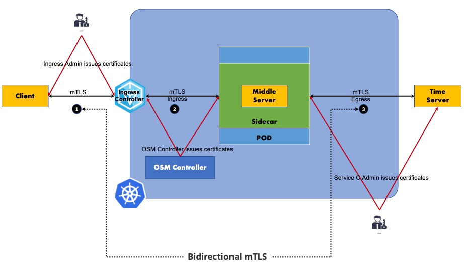

# OSM Edge 双臂 mTLS 测试

## 1. 下载并安装 osm-edge 命令行工具

```bash
system=$(uname -s | tr [:upper:] [:lower:])
arch=$(dpkg --print-architecture)
release=v1.3.0-beta.3
curl -L https://github.com/flomesh-io/osm-edge/releases/download/${release}/osm-edge-${release}-${system}-${arch}.tar.gz | tar -vxzf -
./${system}-${arch}/osm version
cp ./${system}-${arch}/osm /usr/local/bin/
```

## 2. 安装 osm-edge

```bash
export osm_namespace=osm-system 
export osm_mesh_name=osm 

osm install \
    --mesh-name "$osm_mesh_name" \
    --osm-namespace "$osm_namespace" \
    --set=osm.certificateProvider.kind=tresor \
    --set=osm.image.registry=flomesh \
    --set=osm.image.tag=1.3.0-beta.3 \
    --set=osm.image.pullPolicy=Always \
    --set=osm.sidecarLogLevel=error \
    --set=osm.controllerLogLevel=warn \
    --timeout=900s
```

## 3. 安装 FSM

```bash
git clone -b feature/support-mtls-between-ingress-controller-and-backend-services https://github.com/flomesh-io/fsm.git
cd fsm
make dev
helm install --namespace flomesh --create-namespace --set fsm.version=0.2.0-alpha.12-dev --set fsm.logLevel=5 --set fsm.image.pullPolicy=Always fsm charts/fsm/

kubectl wait --namespace flomesh \
  --for=condition=ready pod \
  --selector=app.kubernetes.io/instance=fsm-ingress-pipy \
  --timeout=300s

kubectl patch deployment -n flomesh fsm-ingress-pipy -p \
'{
  "spec": {
    "template": {
      "spec": {
        "containers": [
          {
            "name": "ingress",
            "ports": [
              {
                "containerPort": 8000,
                "hostPort": 80,
                "name": "ingress",
                "protocol": "TCP"
              }
            ]
          }
        ]
      }
    }
  }
}'

```

## 4. 双臂 mTLS 测试

### 4.1 技术概念



### 4.2 部署业务 POD

```bash
#模拟时间服务
kubectl create namespace egress-server
kubectl apply -n egress-server -f https://raw.githubusercontent.com/cybwan/osm-edge-start-demo/main/demo/bidirection-mtls-nginx/server.yaml

#模拟中间件服务
kubectl create namespace egress-middle
osm namespace add egress-middle
kubectl apply -n egress-middle -f https://raw.githubusercontent.com/cybwan/osm-edge-start-demo/main/demo/bidirection-mtls-nginx/middle.yaml

#模拟外部客户端
kubectl create namespace egress-client
kubectl apply -n egress-client -f https://raw.githubusercontent.com/cybwan/osm-edge-start-demo/main/demo/bidirection-mtls-nginx/client.yaml

#等待依赖的 POD 正常启动
kubectl wait --for=condition=ready pod -n egress-server -l app=server --timeout=180s
kubectl wait --for=condition=ready pod -n egress-middle -l app=middle --timeout=180s
kubectl wait --for=condition=ready pod -n egress-client -l app=client --timeout=180s
```

### 4.3 场景测试一：Client HTTP & HTTP Ingress & mTLS Egress

#### 4.3.1 测试指令

流量路径: 

Client --**http**--> ingress-pipy Controller

```bash
kubectl exec "$(kubectl get pod -n egress-client -l app=client -o jsonpath='{.items..metadata.name}')" -n egress-client -- curl -si http://fsm-ingress-pipy-controller.flomesh/hello
```

#### 4.3.2 测试结果

正确返回结果类似于:

```bash
HTTP/1.1 404 Not Found
Server: pipy/0.70.0
content-length: 17
connection: keep-alive

Service Not Found
```

#### 4.3.3 设置 Ingress 策略

```bash
kubectl apply -f - <<EOF
apiVersion: networking.k8s.io/v1
kind: Ingress
metadata:
  name: egress-middle
  namespace: egress-middle
spec:
  ingressClassName: pipy
  rules:
  - http:
      paths:
      - path: /
        pathType: Prefix
        backend:
          service:
            name: middle
            port:
              number: 8080
EOF
```

#### 4.3.4 设置 IngressBackend 策略

```bash
kubectl apply -f - <<EOF
kind: IngressBackend
apiVersion: policy.openservicemesh.io/v1alpha1
metadata:
  name: egress-middle
  namespace: egress-middle
spec:
  backends:
  - name: middle
    port:
      number: 8080 # targetPort of middle service
      protocol: http
  sources:
  - kind: Service
    namespace: flomesh
    name: fsm-ingress-pipy-controller
EOF
```

#### 4.3.5 测试指令

流量路径: 

Client --**http**--> FSM Ingress --**http** --> sidecar --> Middle

```bash
kubectl exec "$(kubectl get pod -n egress-client -l app=client -o jsonpath='{.items..metadata.name}')" -n egress-client -- curl -si http://fsm-ingress-pipy-controller.flomesh/hello
```

#### 4.3.6 测试结果

正确返回结果类似于:

```bash
HTTP/1.1 200 OK
date: Sun, 04 Dec 2022 12:03:47 GMT
content-type: text/plain; charset=utf-8
osm-stats-namespace: egress-middle
osm-stats-kind: Deployment
osm-stats-name: middle
osm-stats-pod: middle-58d9865569-dwcvf
content-length: 13
connection: keep-alive

hello world.
```

#### 4.3.7 禁用Egress目的宽松模式

```bash
export osm_namespace=osm-system
kubectl patch meshconfig osm-mesh-config -n "$osm_namespace" -p '{"spec":{"traffic":{"enableEgress":false}}}' --type=merge
```

#### 4.3.8 启用Egress目的策略模式

```bash
export osm_namespace=osm-system
kubectl patch meshconfig osm-mesh-config -n "$osm_namespace" -p '{"spec":{"featureFlags":{"enableEgressPolicy":true}}}'  --type=merge
```

#### 4.3.9 创建Egress mTLS Secret

```bash
curl https://raw.githubusercontent.com/cybwan/mtls-time-demo/main/certs/ca.crt -o ca.crt
curl https://raw.githubusercontent.com/cybwan/mtls-time-demo/main/certs/middle.crt -o middle.crt
curl https://raw.githubusercontent.com/cybwan/mtls-time-demo/main/certs/middle.key -o middle.key

kubectl create secret generic -n osm-system egress-middle-cert \
  --from-file=ca.crt=./ca.crt \
  --from-file=tls.crt=./middle.crt \
  --from-file=tls.key=./middle.key 
```

#### 4.3.10 设置Egress目的策略

```bash
kubectl apply -f - <<EOF
kind: Egress
apiVersion: policy.openservicemesh.io/v1alpha1
metadata:
  name: server-8443
  namespace: egress-middle
spec:
  sources:
  - kind: ServiceAccount
    name: middle
    namespace: egress-middle
    mtls:
      issuer: other
      cert:
        sn: 1
        expiration: 2030-1-1 00:00:00
        secret:
          name: egress-middle-cert
          namespace: osm-system
  hosts:
  - server.egress-server.svc.cluster.local
  ports:
  - number: 8443
    protocol: http
EOF
```

#### 4.3.11 测试指令

流量路径: 

Client --**http**--> FSM Ingress --**http**--> sidecar --> Middle --> sidecar --**egress mtls**--> Server

```bash
kubectl exec "$(kubectl get pod -n egress-client -l app=client -o jsonpath='{.items..metadata.name}')" -n egress-client -- curl -si http://fsm-ingress-pipy-controller.flomesh/time
```

#### 4.3.12 测试结果

正确返回结果类似于:

```bash
HTTP/1.1 200 OK
date: Sun, 04 Dec 2022 12:08:14 GMT
content-type: text/plain; charset=utf-8
osm-stats-namespace: egress-middle
osm-stats-kind: Deployment
osm-stats-name: middle
osm-stats-pod: middle-58d9865569-dwcvf
content-length: 76
connection: keep-alive

The current time: 2022-12-04 12:08:14.034663797 +0000 UTC m=+1093.291560087
```

本业务场景测试完毕，清理策略，以避免影响后续测试

```bash
kubectl delete ingress -n egress-middle egress-middle
kubectl delete ingressbackend -n egress-middle egress-middle
kubectl delete egress -n egress-middle server-8443
kubectl delete secrets -n osm-system egress-middle-cert
```

### 4.4 场景测试二：HTTP pipy & mTLS Ingress & mTLS Egress

#### 4.4.1 测试指令

流量路径: 

Client --**http**--> FSM Ingress Controller

```bash
kubectl exec "$(kubectl get pod -n egress-client -l app=client -o jsonpath='{.items..metadata.name}')" -n egress-client -- curl -si http://fsm-ingress-pipy-controller.flomesh/hello
```

#### 4.4.2 测试结果

正确返回结果类似于:

```bash
HTTP/1.1 404 Not Found
Server: pipy/0.70.0
content-length: 17
connection: keep-alive

Service Not Found
```

#### 4.4.3 设置 Ingress Controller 证书上下文

```bash
export osm_namespace=osm-system
kubectl patch meshconfig osm-mesh-config -n "$osm_namespace" -p \
'{
  "spec":{
    "certificate":{
      "ingressGateway":{
        "secret":{
          "name":"ingress-controller-cert",
          "namespace":"osm-system"
        },
        "subjectAltNames":["fsm.flomesh.cluster.local"],
        "validityDuration":"24h"
      }
    }
  }
}' \
--type=merge
```
> Note: The Subject Alternative Name (SAN) is of the form <service-account>.<namespace>.cluster.local, where the service account and namespace correspond to the ingress-pipy service.

#### 4.4.4 设置 Ingress 策略

```bash
kubectl apply -f - <<EOF
apiVersion: networking.k8s.io/v1
kind: Ingress
metadata:
  name: egress-middle
  namespace: egress-middle
  annotations:
    # upstream-ssl-name for a service is of the form <service-account>.<namespace>.cluster.local
    pipy.ingress.kubernetes.io/upstream-ssl-name: "middle.egress-middle.cluster.local"
    pipy.ingress.kubernetes.io/upstream-ssl-secret: "osm-system/ingress-controller-cert"
    pipy.ingress.kubernetes.io/upstream-ssl-verify: "on"
spec:
  ingressClassName: pipy
  rules:
  - http:
      paths:
      - path: /
        pathType: Prefix
        backend:
          service:
            name: middle
            port:
              number: 8080
EOF
```

#### 4.4.5 设置 IngressBackend 策略

```bash
kubectl apply -f - <<EOF
kind: IngressBackend
apiVersion: policy.openservicemesh.io/v1alpha1
metadata:
  name: egress-middle
  namespace: egress-middle
spec:
  backends:
  - name: middle
    port:
      number: 8080 # targetPort of middle service
      protocol: https
    tls:
      skipClientCertValidation: false
  sources:
  - kind: Service
    namespace: flomesh
    name: fsm-ingress-pipy-controller
  - kind: AuthenticatedPrincipal
    name: fsm.flomesh.cluster.local
EOF
```

#### 4.4.6 测试指令

流量路径: 

Client --**http**--> ingress-pipy --**mtls** --> sidecar --> Middle

```bash
kubectl exec "$(kubectl get pod -n egress-client -l app=client -o jsonpath='{.items..metadata.name}')" -n egress-client -- curl -si http://fsm-ingress-pipy-controller.flomesh/hello
```

#### 4.4.7 测试结果

正确返回结果类似于:

```bash
HTTP/1.1 200 OK
date: Fri, 09 Dec 2022 08:00:36 GMT
content-type: text/plain; charset=utf-8
osm-stats-namespace: egress-middle
osm-stats-kind: Deployment
osm-stats-name: middle
osm-stats-pod: middle-7956998bd5-bm5vx
content-length: 13
connection: keep-alive

hello world.
```

#### 4.4.8 禁用Egress目的宽松模式

```bash
export osm_namespace=osm-system
kubectl patch meshconfig osm-mesh-config -n "$osm_namespace" -p '{"spec":{"traffic":{"enableEgress":false}}}' --type=merge
```

#### 4.4.9 启用Egress目的策略模式

```bash
export osm_namespace=osm-system
kubectl patch meshconfig osm-mesh-config -n "$osm_namespace" -p '{"spec":{"featureFlags":{"enableEgressPolicy":true}}}'  --type=merge
```

#### 4.4.10 创建Egress mTLS Secret

```bash
curl https://raw.githubusercontent.com/cybwan/mtls-time-demo/main/certs/ca.crt -o ca.crt
curl https://raw.githubusercontent.com/cybwan/mtls-time-demo/main/certs/middle.crt -o middle.crt
curl https://raw.githubusercontent.com/cybwan/mtls-time-demo/main/certs/middle.key -o middle.key

kubectl create secret generic -n osm-system egress-middle-cert \
  --from-file=ca.crt=./ca.crt \
  --from-file=tls.crt=./middle.crt \
  --from-file=tls.key=./middle.key 
```

#### 4.4.11 设置Egress目的策略

```bash
kubectl apply -f - <<EOF
kind: Egress
apiVersion: policy.openservicemesh.io/v1alpha1
metadata:
  name: server-8443
  namespace: egress-middle
spec:
  sources:
  - kind: ServiceAccount
    name: middle
    namespace: egress-middle
    mtls:
      issuer: other
      cert:
        sn: 1
        expiration: 2030-1-1 00:00:00
        secret:
          name: egress-middle-cert
          namespace: osm-system
  hosts:
  - server.egress-server.svc.cluster.local
  ports:
  - number: 8443
    protocol: http
EOF
```

#### 4.4.12 测试指令

流量路径: 

Client --**http**--> ingress-pipy --**mtls**--> sidecar --> Middle --> sidecar --**egress mtls**--> Server

```bash
kubectl exec "$(kubectl get pod -n egress-client -l app=client -o jsonpath='{.items..metadata.name}')" -n egress-client -- curl -si http://fsm-ingress-pipy-controller.flomesh/time
```

#### 4.4.13 测试结果

正确返回结果类似于:

```bash
HTTP/1.1 200 OK
date: Fri, 09 Dec 2022 08:03:59 GMT
content-type: text/plain; charset=utf-8
osm-stats-namespace: egress-middle
osm-stats-kind: Deployment
osm-stats-name: middle
osm-stats-pod: middle-7956998bd5-bm5vx
content-length: 77
connection: keep-alive

The current time: 2022-12-09 08:03:59.990118972 +0000 UTC m=+21257.813505728
```

本业务场景测试完毕，清理策略，以避免影响后续测试

```bash
export osm_namespace=osm-system
kubectl patch meshconfig osm-mesh-config -n "$osm_namespace" -p '{"spec":{"certificate":{"ingressGateway":null}}}' --type=merge

kubectl delete ingress -n egress-middle egress-middle
kubectl delete ingressbackend -n egress-middle egress-middle
kubectl delete egress -n egress-middle server-8443
kubectl delete secrets -n osm-system egress-middle-cert
```


### 4.5 场景测试三：TLS ingress-pipy & mTLS Ingress & mTLS Egress

#### 4.5.1 测试指令

流量路径: 

Client --**http**--> FSM Ingress Controller

```bash
kubectl exec "$(kubectl get pod -n egress-client -l app=client -o jsonpath='{.items..metadata.name}')" -n egress-client -- curl -si http://fsm-ingress-pipy-controller.flomesh/hello
```

#### 4.5.2 测试结果

正确返回结果类似于:

```bash
HTTP/1.1 404 Not Found
Server: pipy/0.70.0
content-length: 17
connection: keep-alive

Service Not Found
```

#### 4.5.3 设置 Ingress Controller 证书上下文

```bash
export osm_namespace=osm-system
kubectl patch meshconfig osm-mesh-config -n "$osm_namespace" -p '{"spec":{"certificate":{"ingressGateway":{"secret":{"name":"ingress-controller-cert","namespace":"osm-system"},"subjectAltNames":["fsm.flomesh.cluster.local"],"validityDuration":"24h"}}}}' --type=merge
```

#### 4.5.4 创建Secret
##### 4.5.4.1 创建 ingress-pipy TLS Secret

```bash
openssl genrsa 2048 > ca.key

openssl req -new -x509 -nodes -days 365000 \
   -key ca.key \
   -out ca.crt \
   -subj '/CN=flomesh.io'

openssl genrsa -out ingress-pipy.key 2048
openssl req -new -key ingress-pipy.key -out ingress-pipy.csr -subj '/CN=fsm-ingress-pipy-controller.flomesh'
openssl x509 -req -in ingress-pipy.csr -CA ca.crt -CAkey ca.key -extfile extfile.cnf -CAcreateserial -out ingress-pipy.crt -days 365

kubectl create secret generic -n egress-middle ingress-pipy-cert-secret \
  --from-file=ca.crt=./ca.crt \
  --from-file=tls.crt=./ingress-pipy.crt \
  --from-file=tls.key=./ingress-pipy.key 
```
##### 4.5.4.2 创建Egress mTLS Secret

```bash
curl https://raw.githubusercontent.com/cybwan/mtls-time-demo/main/certs/ca.crt -o ca.crt
curl https://raw.githubusercontent.com/cybwan/mtls-time-demo/main/certs/middle.crt -o middle.crt
curl https://raw.githubusercontent.com/cybwan/mtls-time-demo/main/certs/middle.key -o middle.key

kubectl create secret generic -n osm-system egress-middle-cert \
  --from-file=ca.crt=./ca.crt \
  --from-file=tls.crt=./middle.crt \
  --from-file=tls.key=./middle.key 
```

#### 4.5.5 设置 Ingress 策略

```bash
kubectl apply -f - <<EOF
apiVersion: networking.k8s.io/v1
kind: Ingress
metadata:
  name: egress-middle
  namespace: egress-middle
  annotations:
    # upstream-ssl-name for a service is of the form <service-account>.<namespace>.cluster.local
    pipy.ingress.kubernetes.io/upstream-ssl-name: "middle.egress-middle.cluster.local"
    pipy.ingress.kubernetes.io/upstream-ssl-secret: "osm-system/ingress-controller-cert"
    pipy.ingress.kubernetes.io/upstream-ssl-verify: "on"
spec:
  ingressClassName: pipy
  rules:
  - http:
      paths:
      - path: /
        pathType: Prefix
        backend:
          service:
            name: middle
            port:
              number: 8080
  tls:
  - hosts:
    - fsm-ingress-pipy-controller.flomesh
    secretName: ingress-pipy-cert-secret
EOF
```

#### 4.5.6 设置 IngressBackend 策略

```bash
kubectl apply -f - <<EOF
kind: IngressBackend
apiVersion: policy.openservicemesh.io/v1alpha1
metadata:
  name: egress-middle
  namespace: egress-middle
spec:
  backends:
  - name: middle
    port:
      number: 8080 # targetPort of middle service
      protocol: https
    tls:
      skipClientCertValidation: false
  sources:
  - kind: Service
    namespace: flomesh
    name: fsm-ingress-pipy-controller
  - kind: AuthenticatedPrincipal
    name: fsm.flomesh.cluster.local
EOF
```

#### 4.5.7 测试指令

流量路径: 

Client --**tls**--> Ingress PIPY --**mtls** --> sidecar --> Middle

```bash
kubectl exec "$(kubectl get pod -n egress-client -l app=client -o jsonpath='{.items..metadata.name}')" -n egress-client -- curl -ksi https://fsm-ingress-pipy-controller.flomesh/hello --key /certs/client.key --cert /certs/client.crt
```

#### 4.5.8 测试结果

正确返回结果类似于:

```bash
HTTP/2 200
date: Thu, 15 Dec 2022 07:02:42 GMT
content-type: text/plain; charset=utf-8
osm-stats-namespace: egress-middle
osm-stats-kind: Deployment
osm-stats-name: middle
osm-stats-pod: middle-5bf7d76c4c-xr24j
content-length: 13

hello world.
```

#### 4.5.9 禁用Egress目的宽松模式

```bash
export osm_namespace=osm-system
kubectl patch meshconfig osm-mesh-config -n "$osm_namespace" -p '{"spec":{"traffic":{"enableEgress":false}}}' --type=merge
```

#### 4.5.10 启用Egress目的策略模式

```bash
export osm_namespace=osm-system
kubectl patch meshconfig osm-mesh-config -n "$osm_namespace" -p '{"spec":{"featureFlags":{"enableEgressPolicy":true}}}'  --type=merge
```


#### 4.5.11 设置Egress目的策略

```bash
kubectl apply -f - <<EOF
kind: Egress
apiVersion: policy.openservicemesh.io/v1alpha1
metadata:
  name: server-8443
  namespace: egress-middle
spec:
  sources:
  - kind: ServiceAccount
    name: middle
    namespace: egress-middle
    mtls:
      issuer: other
      cert:
        sn: 1
        expiration: 2030-1-1 00:00:00
        secret:
          name: egress-middle-cert
          namespace: osm-system
  hosts:
  - server.egress-server.svc.cluster.local
  ports:
  - number: 8443
    protocol: http
EOF
```

#### 4.5.12 测试指令

流量路径: 

Client --**tls**-->  Ingress PIPY --**mtls**--> sidecar --> Middle --> sidecar --**egress mtls**--> Server

```bash
kubectl exec "$(kubectl get pod -n egress-client -l app=client -o jsonpath='{.items..metadata.name}')" -n egress-client -- curl -ksi https://fsm-ingress-pipy-controller.flomesh/time --key /certs/client.key --cert /certs/client.crt
```

#### 4.5.13 测试结果

正确返回结果类似于:

```bash
HTTP/2 200
date: Thu, 15 Dec 2022 07:04:26 GMT
content-type: text/plain; charset=utf-8
osm-stats-namespace: egress-middle
osm-stats-kind: Deployment
osm-stats-name: middle
osm-stats-pod: middle-5bf7d76c4c-xr24j
content-length: 75

The current time: 2022-12-15 07:04:26.62032737 +0000 UTC m=+4972.430170668
```

本业务场景测试完毕，清理策略，以避免影响后续测试

```bash
export osm_namespace=osm-system
kubectl patch meshconfig osm-mesh-config -n "$osm_namespace" -p '{"spec":{"certificate":{"ingressGateway":null}}}' --type=merge

kubectl delete ingress -n egress-middle egress-middle
kubectl delete ingressbackend -n egress-middle egress-middle
kubectl delete egress -n egress-middle server-8443
kubectl delete secrets -n osm-system egress-middle-cert
kubectl delete secrets -n egress-middle ingress-pipy-cert-secret
```

### 4.6 场景测试四：mTLS ingress-pipy & mTLS Ingress & mTLS Egress

#### 4.6.1 测试指令

流量路径: 

Client --**http**--> FSM Ingress Controller

```bash
kubectl exec "$(kubectl get pod -n egress-client -l app=client -o jsonpath='{.items..metadata.name}')" -n egress-client -- curl -si http://fsm-ingress-pipy-controller.flomesh/hello
```

#### 4.6.2 测试结果

正确返回结果类似于:

```bash
HTTP/1.1 404 Not Found
Server: pipy/0.70.0
content-length: 17
connection: keep-alive

Service Not Found
```

#### 4.4.3 设置 Ingress Controller 证书上下文

```bash
export osm_namespace=osm-system
kubectl patch meshconfig osm-mesh-config -n "$osm_namespace" -p '{"spec":{"certificate":{"ingressGateway":{"secret":{"name":"ingress-controller-cert","namespace":"osm-system"},"subjectAltNames":["fsm.flomesh.cluster.local"],"validityDuration":"24h"}}}}' --type=merge
```


#### 4.4.4 创建 ingress-pipy TLS Secret

```bash
openssl genrsa 2048 > ca.key

openssl req -new -x509 -nodes -days 365000 \
   -key ca.key \
   -out ca.crt \
   -subj '/CN=flomesh.io'

openssl genrsa -out ingress-pipy.key 2048
openssl req -new -key ingress-pipy.key -out ingress-pipy.csr -subj '/CN=fsm-ingress-pipy-controller.flomesh'
openssl x509 -req -in ingress-pipy.csr -CA ca.crt -CAkey ca.key -extfile extfile.cnf -CAcreateserial -out ingress-pipy.crt -days 365

kubectl create secret generic -n egress-middle ingress-pipy-cert-secret \
  --from-file=ca.crt=./ca.crt \
  --from-file=tls.crt=./ingress-pipy.crt \
  --from-file=tls.key=./ingress-pipy.key 
```

#### 4.4.6 设置 Ingress 策略

```bash
kubectl apply -f - <<EOF
apiVersion: networking.k8s.io/v1
kind: Ingress
metadata:
  name: egress-middle
  namespace: egress-middle
  annotations:
    pipy.ingress.kubernetes.io/tls-verify-client: "on"
    pipy.ingress.kubernetes.io/tls-verify-depth: "1"

    # upstream-ssl-name for a service is of the form <service-account>.<namespace>.cluster.local
    pipy.ingress.kubernetes.io/upstream-ssl-name: "middle.egress-middle.cluster.local"
    pipy.ingress.kubernetes.io/upstream-ssl-secret: "osm-system/ingress-controller-cert"
    pipy.ingress.kubernetes.io/upstream-ssl-verify: "on"
spec:
  ingressClassName: pipy
  rules:
  - http:
      paths:
      - path: /
        pathType: Prefix
        backend:
          service:
            name: middle
            port:
              number: 8080
  tls:
  - hosts:
    - fsm-ingress-pipy-controller.flomesh
    secretName: ingress-pipy-cert-secret
EOF
```

#### 4.4.7 设置 IngressBackend 策略

```bash
kubectl apply -f - <<EOF
kind: IngressBackend
apiVersion: policy.openservicemesh.io/v1alpha1
metadata:
  name: egress-middle
  namespace: egress-middle
spec:
  backends:
  - name: middle
    port:
      number: 8080 # targetPort of middle service
      protocol: https
    tls:
      skipClientCertValidation: false
  sources:
  - kind: Service
    namespace: flomesh
    name: fsm-ingress-pipy-controller
  - kind: AuthenticatedPrincipal
    name: fsm.flomesh.cluster.local
EOF
```

#### 4.4.8 测试指令

流量路径: 

Client --**mtls**--> Ingress PIPY --**mtls** --> sidecar --> Middle

```bash
kubectl exec "$(kubectl get pod -n egress-client -l app=client -o jsonpath='{.items..metadata.name}')" -n egress-client -- curl -ksi https://fsm-ingress-pipy-controller.flomesh/hello  --cacert /certs/ca.crt --key /certs/client.key --cert /certs/client.crt
```

#### 4.4.9 测试结果

正确返回结果类似于:

```bash
HTTP/2 200
date: Thu, 15 Dec 2022 08:55:01 GMT
content-type: text/plain; charset=utf-8
osm-stats-namespace: egress-middle
osm-stats-kind: Deployment
osm-stats-name: middle
osm-stats-pod: middle-5bf7d76c4c-xr24j
content-length: 13

hello world.
```

#### 4.4.10 禁用Egress目的宽松模式

```bash
export osm_namespace=osm-system
kubectl patch meshconfig osm-mesh-config -n "$osm_namespace" -p '{"spec":{"traffic":{"enableEgress":false}}}' --type=merge
```

#### 4.4.11 启用Egress目的策略模式

```bash
export osm_namespace=osm-system
kubectl patch meshconfig osm-mesh-config -n "$osm_namespace" -p '{"spec":{"featureFlags":{"enableEgressPolicy":true}}}'  --type=merge
```

#### 4.4.12 创建Egress mTLS Secret

```bash
curl https://raw.githubusercontent.com/cybwan/mtls-time-demo/main/certs/ca.crt -o ca.crt
curl https://raw.githubusercontent.com/cybwan/mtls-time-demo/main/certs/middle.crt -o middle.crt
curl https://raw.githubusercontent.com/cybwan/mtls-time-demo/main/certs/middle.key -o middle.key

kubectl create secret generic -n osm-system egress-middle-cert \
  --from-file=ca.crt=./ca.crt \
  --from-file=tls.crt=./middle.crt \
  --from-file=tls.key=./middle.key 
```

#### 4.4.13 设置Egress目的策略

```bash
kubectl apply -f - <<EOF
kind: Egress
apiVersion: policy.openservicemesh.io/v1alpha1
metadata:
  name: server-8443
  namespace: egress-middle
spec:
  sources:
  - kind: ServiceAccount
    name: middle
    namespace: egress-middle
    mtls:
      issuer: other
      cert:
        sn: 1
        expiration: 2030-1-1 00:00:00
        secret:
          name: egress-middle-cert
          namespace: osm-system
  hosts:
  - server.egress-server.svc.cluster.local
  ports:
  - number: 8443
    protocol: http
EOF
```

#### 4.4.14 测试指令

流量路径: 

Client --**mtls**--> Ingress PIPY --**mtls**--> sidecar --> Middle --> sidecar --**egress mtls**--> Server

```bash
kubectl exec "$(kubectl get pod -n egress-client -l app=client -o jsonpath='{.items..metadata.name}')" -n egress-client -- curl -ksi https://fsm-ingress-pipy-controller.flomesh/time --cacert /certs/ca.crt --key /certs/client.key --cert /certs/client.crt
```

#### 4.4.15 测试结果

正确返回结果类似于:

```bash
HTTP/2 200
date: Thu, 15 Dec 2022 08:56:12 GMT
content-type: text/plain; charset=utf-8
osm-stats-namespace: egress-middle
osm-stats-kind: Deployment
osm-stats-name: middle
osm-stats-pod: middle-5bf7d76c4c-xr24j
content-length: 76

The current time: 2022-12-15 08:56:12.953677725 +0000 UTC m=+6997.289902113
```

本业务场景测试完毕，清理策略，以避免影响后续测试

```bash
export osm_namespace=osm-system
kubectl patch meshconfig osm-mesh-config -n "$osm_namespace" -p '{"spec":{"certificate":{"ingressGateway":null}}}' --type=merge

kubectl delete ingress -n egress-middle egress-middle
kubectl delete ingressbackend -n egress-middle egress-middle
kubectl delete egress -n egress-middle server-8443
kubectl delete secrets -n osm-system egress-middle-cert
kubectl delete secrets -n egress-middle ingress-pipy-cert-secret
```

