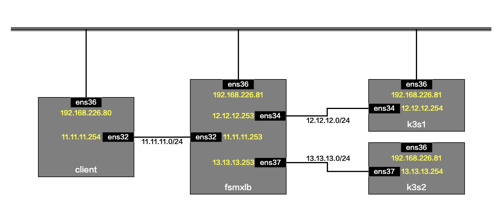

# FSM xLB 负载均衡测试

本测试已经在 Ubuntu 20.04 下验证.

## 1 网络拓扑



## 2 部署负载均衡服务

**在FsmXLB:**

### 2.1 安装容器环境

```bash
for pkg in docker.io docker-doc docker-compose podman-docker containerd runc; do sudo apt-get remove ${pkg}; done
sudo apt -y update
sudo apt -y install ca-certificates curl gnupg
sudo install -m 0755 -d /etc/apt/keyrings
curl -fsSL https://download.docker.com/linux/ubuntu/gpg | sudo gpg --dearmor -o /etc/apt/keyrings/docker.gpg
sudo chmod a+r /etc/apt/keyrings/docker.gpg
echo "deb [arch=$(dpkg --print-architecture) signed-by=/etc/apt/keyrings/docker.gpg] https://download.docker.com/linux/ubuntu $(. /etc/os-release && echo ${VERSION_CODENAME}) stable"  | \
sudo tee /etc/apt/sources.list.d/docker.list > /dev/null
sudo apt -y update
sudo apt -y install docker-ce docker-ce-cli containerd.io docker-compose-plugin
```

### 2.2 配置容器网络

```bash
docker network create -d macvlan -o parent=ens36 --subnet 11.11.11.0/24 --gateway 11.11.11.254 --aux-address 'host=11.11.11.253' xlbnet1

docker network create -d macvlan -o parent=ens33 --subnet 12.12.12.0/24 --gateway 12.12.12.254 --aux-address 'host=12.12.12.253' xlbnet2

docker network ls
```

### 2.3 创建负载均衡服务容器

```bash
docker run -u root --cap-add SYS_ADMIN  --restart unless-stopped --privileged -dit -v /dev/log:/dev/log --name fsmxlb cybwan/fsm-xlb:1.0.1

docker network connect xlbnet1 fsmxlb --ip=11.11.11.1
docker network connect xlbnet2 fsmxlb --ip=12.12.12.1

docker exec fsmxlb ifconfig

#docker exec -it fsmxlb bash
```

## 3 部署配置 k3s

**在Node1(k3s):**

### 3.1 安装k3s

```bash
curl -sfL https://get.k3s.io | INSTALL_K3S_VERSION=v1.22.9+k3s1 INSTALL_K3S_EXEC="server --disable metrics-server --disable traefik --disable servicelb --disable-cloud-controller --kubelet-arg cloud-provider=external" sh -
#k3s-uninstall.sh

sudo kubectl taint nodes --all node.cloudprovider.kubernetes.io/uninitialized=false:NoSchedule-

watch -n 2 kubectl get pods -A -o wide
```

### 3.2 部署 fsm-ccm

```bash
export CTR_REGISTRY=cybwan
export CTR_TAG=1.0.1
export fsmxlb_api_server_addr=12.12.12.1
export fsmxlb_external_cidr=123.123.123.0/24
curl https://raw.githubusercontent.com/cybwan/fsmxlb/main/manifests/fsm-ccm-k3s.yaml -o /tmp/fsm-ccm-k3s.yaml
cat /tmp/fsm-ccm-k3s.yaml | envsubst | kubectl apply -f -

watch -n 2 kubectl get pods -A -o wide
```

### 3.3 部署模拟业务

```bash
kubectl apply -f - <<EOF
apiVersion: v1
kind: Service
metadata:
  name: pipy-ok
spec:
  ports:
    - name: pipy
      port: 8080
      targetPort: 8080
      protocol: TCP
  selector:
    app: pipy-ok
---
apiVersion: v1
kind: Service
metadata:
  name: pipy-ok-v1
spec:
  ports:
    - name: pipy
      port: 8080
      targetPort: 8080
      protocol: TCP
  selector:
    app: pipy-ok
    version: v1
---
apiVersion: v1
kind: Service
metadata:
  name: pipy-ok-v2
spec:
  ports:
    - name: pipy
      port: 8080
      targetPort: 8080
      protocol: TCP
  selector:
    app: pipy-ok
    version: v2
---
apiVersion: apps/v1
kind: Deployment
metadata:
  name: pipy-ok-v1
  labels:
    app: pipy-ok
    version: v1
spec:
  replicas: 1
  selector:
    matchLabels:
      app: pipy-ok
      version: v1
  template:
    metadata:
      labels:
        app: pipy-ok
        version: v1
    spec:
      containers:
        - name: pipy
          image: flomesh/pipy:latest
          ports:
            - name: pipy
              containerPort: 8080
          command:
            - pipy
            - -e
            - |
              pipy()
              .listen(8080)
              .serveHTTP(new Message('Hi, I am v1!'))
---
apiVersion: apps/v1
kind: Deployment
metadata:
  name: pipy-ok-v2
  labels:
    app: pipy-ok
    version: v2
spec:
  replicas: 1
  selector:
    matchLabels:
      app: pipy-ok
      version: v2
  template:
    metadata:
      labels:
        app: pipy-ok
        version: v2
    spec:
      containers:
        - name: pipy
          image: flomesh/pipy:latest
          ports:
            - name: pipy
              containerPort: 8080
          command:
            - pipy
            - -e
            - |
              pipy()
              .listen(8080)
              .serveHTTP(new Message('Hi, I am v2!'))
EOF

kubectl apply -f - <<EOF
apiVersion: v1
kind: Service
metadata:
  name: pipy-ok-lb
spec:
  selector:
    app: pipy-ok
  ports:
    - protocol: TCP
      port: 8080
  type: LoadBalancer
EOF

sudo kubectl get svc

#等待 Pod 启动完成
watch -n 2 kubectl get pods -A -o wide
```

### 3.4 添加到客户区路由

```
sudo ip r add 11.11.11.0/24 via 12.12.12.1
```

## 4 访问测试

**在Node3(Client):**

```
ip r add 123.123.123.0/24 via 11.11.11.1

curl http://123.123.123.1:8080
```

